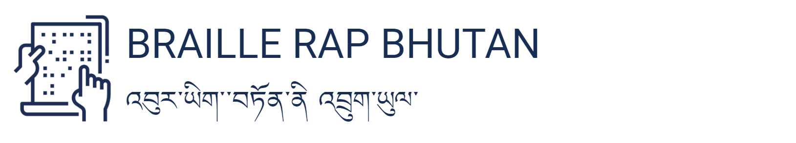

# BrailleRap 6.5 Bhutan Iteration

- This project was created as a part of the team effort of the **Assistive Learning Units (ALU)** group from the CST Fablab in Phuentsholing, Bhutan for the Fab Bhutan Challenge 2023 - Designing Resilient Futures. 
- The project was based on a slightly modified BrailleRap project: https://github.com/braillerap/BrailleRap
- A custom UI for the Bhutan iteration: https://github.com/kyjanond/BrailleRapUI

### Documentation of the original project
the full documentation is available here https://braillerap-en.readthedocs.io/en/latest/index.html

